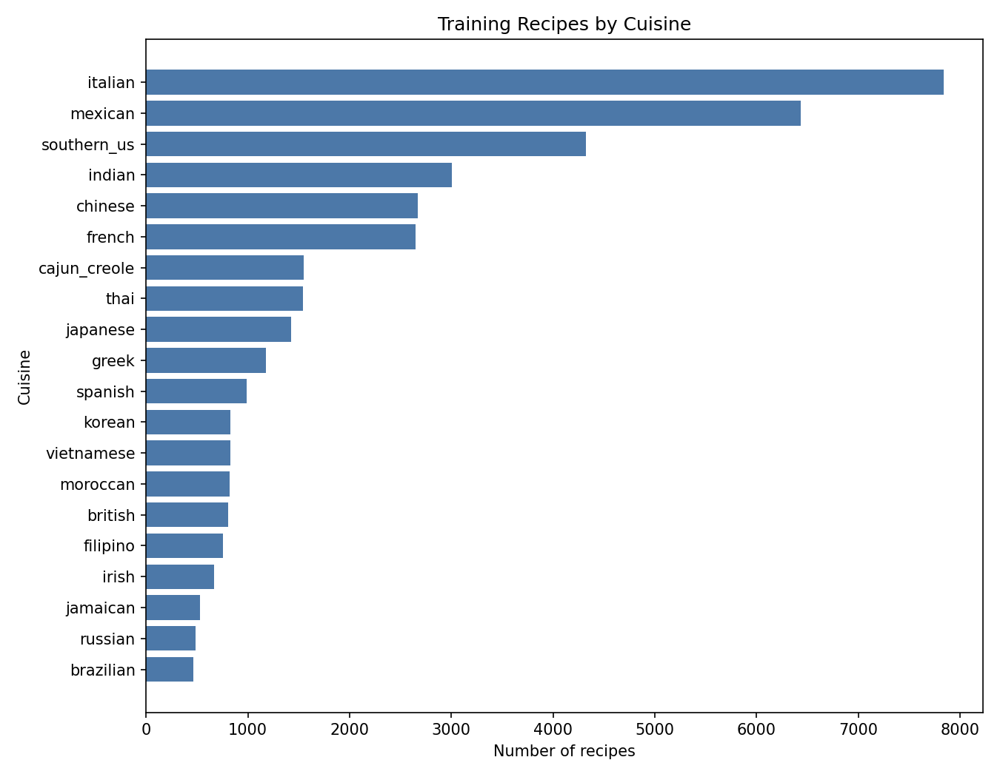
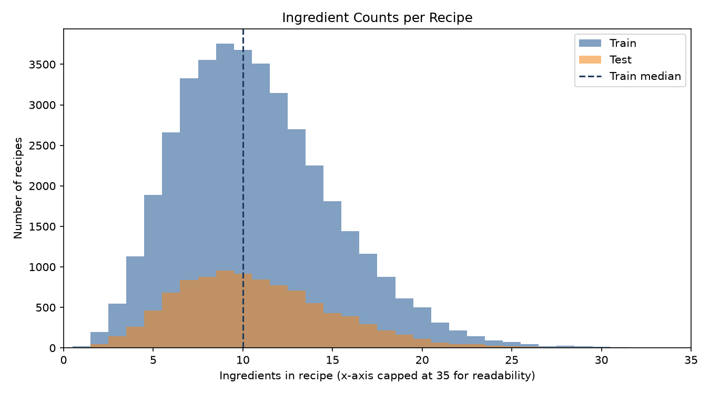
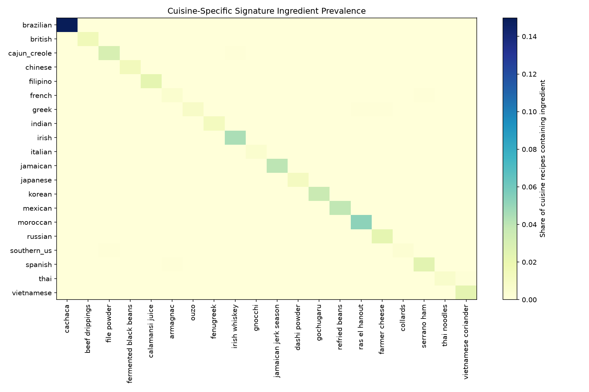

# Part 1: What's Cooking? Cuisine Classification

This AI-assisted data science project uses Kaggle's **What's Cooking?** dataset to predict a recipe's cuisine from its ingredient list. The dataset contains 39,774 training recipes, 9,944 test recipes, and 20 cuisine classes.

## Methodology

Ingredient lists are represented as normalized full phrases: ingredients are lowercased, trimmed, and de-duplicated within each recipe while keeping phrases such as `soy sauce` intact. A binary `CountVectorizer` converts these phrases into features; recipe IDs are intentionally excluded.

Validation uses 3-fold `StratifiedGroupKFold`, grouping duplicate normalized ingredient sets to reduce optimistic validation caused by repeated recipes. The experiment compares a majority-class baseline, Multinomial Naive Bayes, Logistic Regression, and Linear SVM.

## Final results

| Model | Accuracy | Macro F1 |
| --- | ---: | ---: |
| Multinomial Naive Bayes | 0.7453 | 0.6527 |
| Linear SVM | 0.7426 | 0.6552 |
| Logistic Regression | 0.7405 | 0.6660 |
| Majority baseline | 0.1971 | 0.0165 |

`MultinomialNB(alpha=0.5)` was selected because it achieved the highest grouped-validation accuracy. Logistic Regression achieved the highest macro F1, showing the tradeoff between overall accuracy and balanced class performance.







## AI workflow

ChatGPT helped with planning, review, and prompt refinement; Codex handled agentic implementation and debugging. I reviewed and verified the resulting analysis. Standardizing the project on Python 3.11 and scikit-learn 1.9 changed the final model ranking, which reinforces that AI-produced work must be checked in the intended environment. See [PROMPTS.md](PROMPTS.md) for the recorded workflow prompts.

## Streamlit demo

[app.py](app.py) provides a small local interface for entering ingredients and viewing a predicted cuisine plus the top three probabilities. It loads the saved model artifact rather than retraining on each rerun.

```bash
conda activate cmpe255-a1
cd part-1-whats-cooking
streamlit run app.py
```

## Main artifacts

- [Reproducible analysis notebook](notebooks/whats_cooking_analysis.ipynb)
- [Dataset notes and final implementation details](DATASET_NOTES.md)
- [AI workflow prompts](PROMPTS.md)
- [Streamlit demo](app.py)
- [Kaggle-format test predictions](outputs/submission.csv)
- [Model comparison results](outputs/model_comparison.csv)
- [Project article](article.md)
