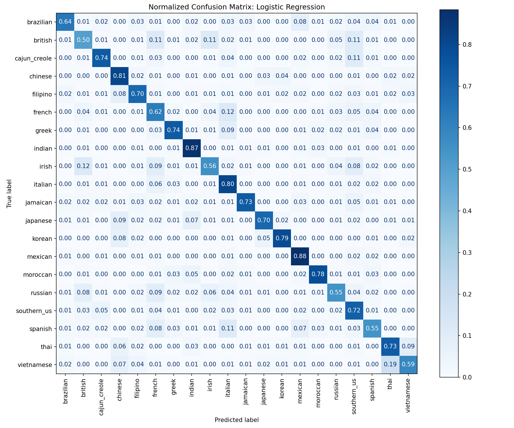

# Building a Data Science Project with AI Agents: What Worked, What Broke, and What I Learned

## Introduction

For Part 1 of my CMPE 255 Data Mining assignment, I built a cuisine classifier using Kaggle's *What's Cooking?* dataset. The task is simple to describe: given a recipe's ingredient list, predict its cuisine. The more interesting part of the assignment, for me, was the process. I wanted to understand what actually happens when an AI coding agent is used to help build an end-to-end data science project rather than just generate a few isolated code snippets.

I chose this dataset because it is compact enough for a class project but still has real modeling concerns: a multiclass target, class imbalance, messy ingredient text, duplicate recipes, and a competition-style test set. It also supports a clear workflow from inspection and exploratory analysis to validation, interpretation, submission generation, and a small interactive demo.

The outcome was useful, but the path was not completely smooth. AI accelerated the work substantially, especially the repetitive implementation and debugging steps. At the same time, environment compatibility changed the model ranking after the first run. That became the most important lesson of the project: an agent can produce plausible and useful work quickly, but it does not replace validation, reproducibility, or methodological judgment.

## My AI-Assisted Workflow

I used ChatGPT and Codex for different parts of the workflow. ChatGPT helped me plan the work, review methodology, and refine prompts into bounded tasks. Codex, running in VS Code, was the main coding agent. It inspected the repository and dataset, created the analysis notebook, implemented the modeling experiment, generated charts and output files, and later created the small Streamlit demonstration app.

I did not treat the agent as an automatic solution. I reviewed the dataset notes, approved the broad modeling plan, checked the generated artifacts, and redirected the work when the Python environment did not match my intended setup. The sequence of prompts is recorded in [PROMPTS.md](PROMPTS.md). Keeping that record matters because it shows how the project evolved: repository scaffolding came first, then dataset inspection, then the notebook, then the app, then compatibility auditing and standardization.

Breaking the project into those small requests made the collaboration manageable. Asking for a full application, model search, and report in one prompt would have made it hard to see what the agent was assuming. Instead, I could inspect the data-quality findings before accepting a validation design, and I could insist that the app reuse the selected model rather than quietly training another one.

## Understanding the Dataset Before Modeling

The training data contains 39,774 recipes and the test data contains 9,944 recipes. Each training recipe has an `id`, a cuisine label, and a list of ingredients; the test data omits the label. There are 20 cuisines, so this is a multiclass classification problem rather than a collection of separate yes/no predictions.

The first inspection uncovered details that influenced the rest of the project. The classes are imbalanced: Italian is the largest class and Brazilian is the smallest. A model that always predicts the most common cuisine would therefore get some accuracy without learning meaningful distinctions. Ingredient lists also contain phrases rather than standardized fields. For example, ingredients can differ by capitalization, specificity, spelling, or brand names. I wanted to preserve meaningful phrases such as `soy sauce` and `olive oil` rather than reduce every recipe to unrelated individual words.

Duplicate ingredient sets were another important finding. Some duplicate sets occurred in more than one recipe, and a small number even had conflicting cuisine labels. A normal random train/validation split could place an identical ingredient set in both sides, giving an overly optimistic estimate of performance. Instead of automatically deleting duplicates, I grouped equivalent normalized ingredient sets during validation. The full inspection details, including missingness, duplicate counts, and ingredient statistics, are in [DATASET_NOTES.md](DATASET_NOTES.md).

## Modeling Approach

The final feature representation is intentionally straightforward. Each ingredient phrase is lowercased, trimmed, and de-duplicated within its recipe. The recipe then becomes a binary `CountVectorizer` representation: a feature is 1 when a normalized phrase is present and 0 otherwise. Recipe IDs are excluded because they are identifiers, not culinary information, and could introduce accidental patterns.

I used 3-fold `StratifiedGroupKFold` for local validation. The stratification helps retain the cuisine distribution across folds, while grouping keeps identical normalized ingredient sets together. The original plan proposed five folds, but the finished experiment used three as a practical runtime compromise. This retained the key leakage-prevention property without turning the assignment into a large hyperparameter search.

The experiment compared four understandable models using the same features and folds:

- a majority-class baseline;
- `MultinomialNB(alpha=0.5)`;
- native multiclass Logistic Regression; and
- `LinearSVC` with balanced class weights.

Accuracy was the primary selection metric because the Kaggle-style task requires one cuisine prediction for each recipe. I also reported macro F1 because it gives each cuisine equal influence and makes weak performance on smaller classes easier to notice. This was a deliberate choice to balance competition alignment with a more complete class-level evaluation.

The cuisine-signature visualization is useful because globally frequent ingredients such as salt and onions do not explain much by themselves. Looking at ingredients that occur disproportionately often within a cuisine provides a more meaningful view of which phrases may separate classes. The notebook keeps these features interpretable while avoiding more complicated embeddings or deep-learning models that would have been unnecessary for the assignment's goals.

## The Most Important Part: Verifying the Agent

The biggest learning moment did not come from the first model comparison. It came from checking whether the notebook was actually reproducible in the intended environment.

The initial notebook had been created against an older Python and scikit-learn environment. My intended project environment was the `cmpe255-a1` Conda environment using Python 3.11. After switching to it, I found that compatibility could not be treated as a minor setup detail. Logistic Regression used multiclass API behavior that had changed in the newer scikit-learn version, and `LinearSVC` behavior was also version-sensitive. There were notebook execution, path, and kernel issues to work through as well.

This was exactly the point where a casual AI workflow could have gone wrong. It would have been easy to accept a statement that the notebook had executed successfully, copy the earlier scores into a report, and move on. Instead, I requested a compatibility audit, reviewed the findings, and had the notebook standardized and rerun under the canonical environment: Python 3.11.16 and scikit-learn 1.9. The final environment versions and the specific compatibility rationale are documented in [DATASET_NOTES.md](DATASET_NOTES.md).

The updated Logistic Regression uses the current native multiclass behavior rather than preserving an obsolete one-versus-rest configuration just for backward compatibility. `LinearSVC` also uses explicit current settings. More importantly, the complete notebook was rerun from top to bottom, and its plots, evaluation tables, interpretation artifacts, submission, and application model artifact were regenerated. I manually inspected the execution and outputs rather than relying only on an agent's status message.

This verification step changed the final ranking. That is not a failure of AI by itself; it is a reminder that code correctness depends on its environment and that model results are empirical. A command that looks reasonable can still be deprecated, removed, or behave differently across library versions. Reproducibility includes the interpreter, package versions, kernel configuration, paths, and the ability to execute the full workflow again.

## Final Canonical Results

After standardizing the environment and rerunning the experiment, the canonical 3-fold grouped-validation results were:

| Model | Accuracy | Macro F1 |
| --- | ---: | ---: |
| Multinomial Naive Bayes | 0.7453 | 0.6527 |
| Linear SVM | 0.7426 | 0.6552 |
| Logistic Regression | 0.7405 | 0.6660 |
| Majority baseline | 0.1971 | 0.0165 |

`MultinomialNB(alpha=0.5)` was selected because it produced the highest validation accuracy, 0.7453. Logistic Regression had the highest macro F1, 0.6660. The leading models were close, so the selection is not a claim that Naive Bayes is universally superior. It is the model that best matched the pre-declared primary metric for this experiment.

The difference between accuracy and macro F1 was informative. Accuracy reflects the overall prediction rate across all recipes, while macro F1 gives equal weight to each cuisine. The results show why it is useful to report both: an accuracy-focused selection can still have a different tradeoff from the model with the most balanced per-class performance.

The confusion matrix and per-class report make the aggregate numbers more concrete. Some cuisines are easier to identify from distinctive ingredient patterns, while cuisines with overlapping ingredients are harder to separate. These limitations are expected because ingredients alone omit quantities, preparation methods, and cultural context. The notebook and associated outputs preserve the detailed evaluation rather than reducing the project to a single score.

## From Notebook to Small App

After model selection, I added a deliberately small Streamlit demo in [app.py](app.py). A user can enter ingredients on separate lines or separated by commas. The app normalizes simple input issues such as whitespace, capitalization, and repeated ingredients, predicts a cuisine, and displays the top predicted cuisines with probabilities.

The app loads the saved classifier artifact instead of retraining whenever Streamlit reruns. It also uses the same selected modeling approach as the canonical notebook: normalized full ingredient phrases, binary features, and `MultinomialNB(alpha=0.5)`. This kept the demo aligned with the experiment rather than turning it into a separate, unvalidated model. The app is intentionally a local demonstration, not a production system.

## What I Learned

The project changed how I think about using AI agents for data science work. Good prompts helped because they constrained scope. Telling the agent not to modify raw data, not to build an application too early, and not to turn the work into a large hyperparameter search made the output easier to review. Still, prompt quality alone did not guarantee correctness.

I found AI especially effective for scaffolding, repeated implementation work, creating clear first drafts of notebook structure, and debugging concrete errors. It was also useful for turning a plan into linked artifacts: a dataset note, a notebook, output tables and plots, a submission file, and a small demo. Those are real productivity gains.

But I still needed to understand why grouped validation mattered, what target leakage could look like, how accuracy differs from macro F1, and why an ID should not be a feature. I also needed to notice the environment mismatch and insist on a full canonical rerun. Manually verifying execution exposed issues that an earlier agent run had not fully resolved.

My main takeaway is that reproducibility is part of data science, not a setup task to postpone until the end. If another person cannot run the notebook with the documented environment and obtain the same generated artifacts, then the analysis is not fully complete. In this project, the environment standardization was not cosmetic: it affected the final model comparison and selection.

I now see AI agents as capable collaborators rather than substitutes for data-science judgment. They can move a project forward quickly, but they are most useful when I provide constraints, inspect their work, test the workflow, and retain responsibility for the conclusions.

## Conclusion

AI significantly accelerated this assignment, from initial dataset inspection through the notebook, generated artifacts, and local demo. The most valuable result, however, was not simply a 74.53% cuisine classifier. It was learning that using an AI agent does not remove the need for understanding, verification, and methodological judgment. The agent made the work faster; careful review made the final experiment trustworthy.
