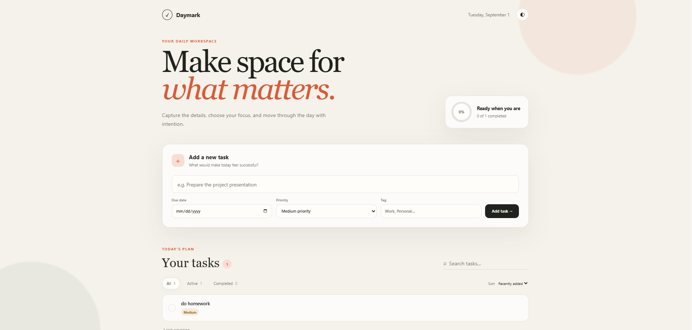
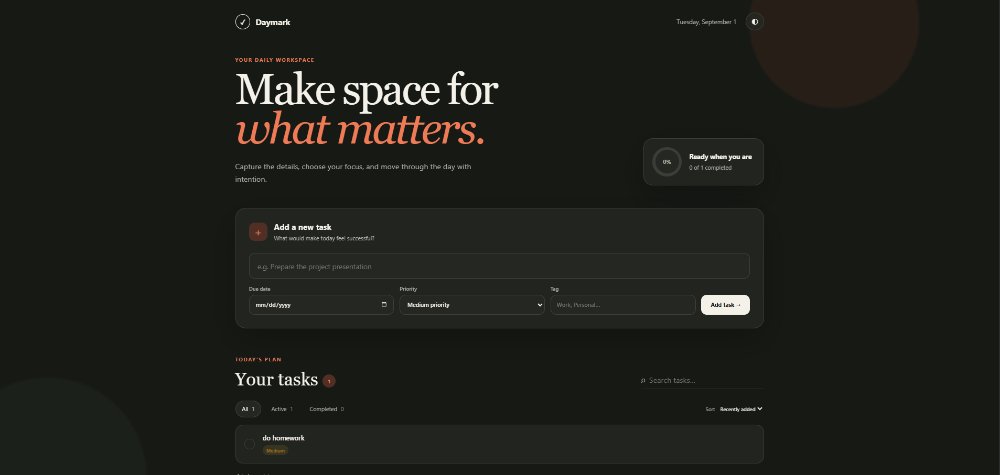

# Project 00: Dynamic Todo Workspace

Daymark is a responsive, dependency-free todo workspace built with HTML, CSS, and JavaScript. It supports persistent tasks, priorities, due dates, tags, search, filters, sorting, editing, completion progress, bulk cleanup, and light/dark themes.

## Run locally

From this directory, start any static web server. For example:

```bash
python -m http.server 8000
```

Then open <http://localhost:8000> in a browser. No installation or build step is required.

## Data storage

Tasks and theme preferences are stored locally in the browser using `localStorage`. No data is sent to a server.

## Screenshots




