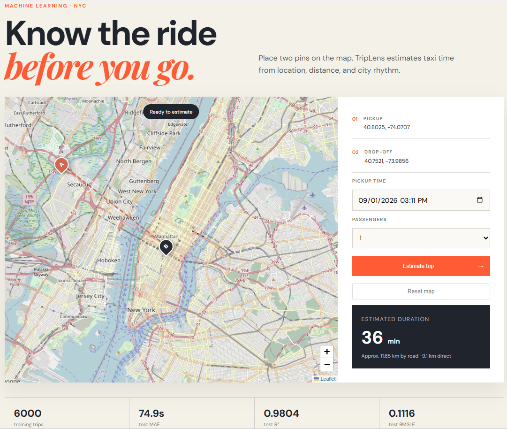

# NYC Taxi Trip Prediction

An end-to-end, locally runnable data science project inspired by Kaggle's NYC Taxi Trip Duration challenge. It includes reproducible data generation, training and evaluation, a Flask prediction API, and a responsive frontend with an interactive map and trip-time estimation.

## Run locally

```bash
python -m venv .venv
# Windows: .venv\Scripts\activate
# macOS/Linux: source .venv/bin/activate
pip install -r requirements.txt
python train.py
python app.py
```

Open <http://127.0.0.1:5000>. Click the map to set pickup and drop-off points, choose a pickup time and passenger count, then estimate. The map tiles and web fonts require an internet connection; modeling and prediction run entirely locally.

The default training command creates a deterministic 6,000-row NYC-like sample, so no download is required. To use the Kaggle challenge data instead:

```bash
python train.py --csv path/to/train.csv --rows 100000
```

Expected Kaggle columns are `pickup_datetime`, pickup/drop-off latitude and longitude, `passenger_count`, and `trip_duration`.

## CRISP-DM workflow

1. **Business understanding:** estimate taxi duration before a ride to support rider expectations and dispatch planning.
2. **Data understanding:** inspect geospatial, calendar, passenger, and duration fields; constrain the target to 1–120 minutes.
3. **Data preparation:** parse timestamps and derive hour, weekday, weekend, and Haversine distance features.
4. **Modeling:** fit a deterministic random forest to `log1p(trip_duration)` to handle the target's right skew.
5. **Evaluation:** use a fixed 80/20 split and report MAE, RMSLE, R², and median-baseline MAE in `artifacts/metrics.json`.
6. **Deployment:** load the persisted model behind Flask's `/predict` endpoint and expose it through the map UI.

## Results and limitations

On the deterministic 6,000-row sample and fixed 80/20 split, the current model achieved **74.9 seconds MAE**, **0.1116 RMSLE**, and **0.9804 R²**, versus **537.6 seconds MAE** for a median-duration baseline. Run `python train.py` to reproduce the metrics.

The generated sample is deliberately small and encodes realistic distance and rush-hour effects; it demonstrates the full pipeline but is not evidence of real-world accuracy. The road distance shown in the UI is an explicit 1.28× approximation of Haversine distance, not a routing-engine result. A production version should train on reviewed Kaggle/TLC data, validate temporal drift, use routed road distance and traffic/weather signals, and add monitoring.

## Tests

```bash
python -m pytest -q
```

The tests cover the home/health routes, a plausible end-to-end prediction, and coordinate validation.

## Screenshots


