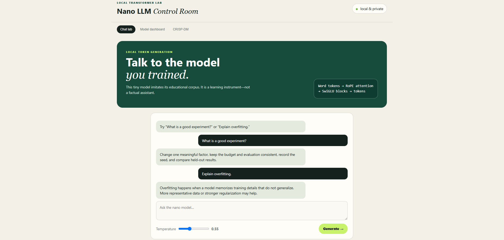
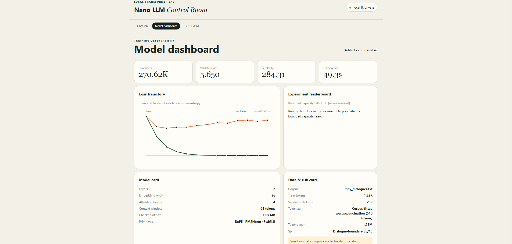
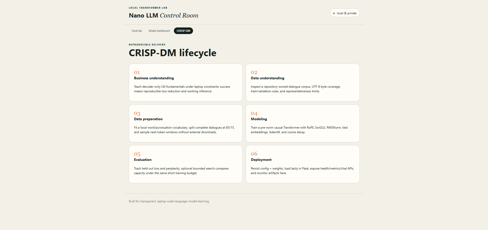

# Nano LLM Transformer

A laptop-scale, from-scratch decoder-only Transformer, local chatbot, and data-science admin dashboard. It uses current practical primitives—PyTorch scaled-dot-product causal attention, RoPE, pre-norm RMSNorm, SwiGLU, tied embeddings, AdamW, warmup/cosine decay, mixed precision on CUDA, and clipped gradients—without pretrained weights or external services.

## Setup, train, and run

```bash
cd part-2-data-science-examples/02_nano_llm_transformer
python -m venv .venv
# Windows: .venv\Scripts\activate
# macOS/Linux: source .venv/bin/activate
pip install -r requirements.txt
python train.py
python app.py
```

Open <http://127.0.0.1:5001>. Training automatically chooses CUDA, Apple MPS, or CPU. The default model has about 250,000 parameters and 1,200 short steps; use `python train.py --steps 100` for a faster smoke run. Artifacts are written to `artifacts/nano_llm.pt` and `artifacts/metrics.json`.

For fixed-seed command-line generations, run `python generate.py` or pass quoted prompts after the command.

Run a bounded three-candidate capacity experiment before final training with:

```bash
python train.py --search --search-steps 40
```

This is lightweight hill climbing, not an exhaustive hyperparameter claim: candidates receive the same short budget and the lowest held-out loss selects the final capacity.

## CRISP-DM and engineering design

1. **Business understanding:** demonstrate how a modern causal LM is trained, evaluated, persisted, and served within a normal laptop budget. Success is a declining held-out next-token loss plus verified generation—not general intelligence.
2. **Data understanding:** use the included repository-owned educational dialogue corpus, with explicit source, token counts, split, and limitations in the dashboard.
3. **Data preparation:** normalize text to ASCII, fit a compact word/punctuation vocabulary, split complete dialogues deterministically at 85/15, and sample fixed context windows. The fitted vocabulary is saved in the checkpoint, cannot emit malformed UTF-8, and needs no tokenizer download.
4. **Modeling:** train a pre-norm decoder with causal SDPA, RoPE, RMSNorm, SwiGLU, residual connections, weight tying, AdamW, warmup/cosine scheduling, and gradient clipping. CUDA uses automatic mixed precision.
5. **Evaluation:** record train/validation cross-entropy, perplexity, gradient norm, learning rate, runtime, token budget, seed, and optional search results. Tiny-corpus metrics measure corpus imitation only.
6. **Deployment:** save configuration, weights, and metadata together; lazily load the checkpoint in Flask; expose `/api/health`, `/api/metrics`, and `/api/chat`; show model, data, experiments, loss curves, and caveats in the dashboard.

Key source rationale: [RoFormer](https://arxiv.org/abs/2104.09864) introduced RoPE; [PyTorch SDPA](https://docs.pytorch.org/docs/stable/generated/torch.nn.functional.scaled_dot_product_attention.html) selects an available optimized attention implementation; [GLU Variants Improve Transformer](https://arxiv.org/abs/2002.05202) describes SwiGLU; and [Chinchilla](https://papers.nips.cc/paper_files/paper/2022/hash/c1e2faff6f588870935f114ebe04a3e5-Paper-Conference.pdf) motivates treating model size, token count, and compute as a joint budget. These ideas are scaled down for pedagogy; this project does not reproduce the papers' results.

## Tests and limitations

```bash
python -m pytest -q
```

The integration test trains a tiny model, saves and reloads it, generates tokens, and exercises the dashboard, health, metrics, and chat routes. The bundled dataset is intentionally tiny and synthetic. Generated text can be incoherent, biased by the corpus, or wrong; do not use it for factual, safety-critical, or production decisions. A serious extension needs reviewed large-scale data, subword tokenization, stronger benchmarks, safety evaluation, KV-cached inference, quantization, and drift/latency monitoring.

## Screenshots






