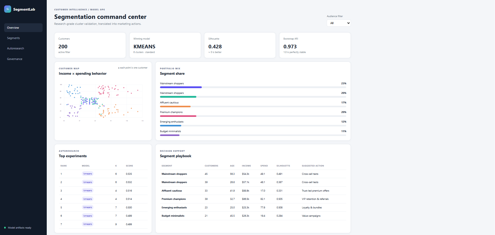

# Customer Segmentation Clustering

A compact, offline-friendly customer segmentation project built on the popular 200-row **Mall Customers** dataset. It follows CRISP-DM, runs a reproducible clustering autoresearch loop, saves deployable artifacts, and serves a responsive Flask administration dashboard.

## Quick start

```powershell
cd part-2-data-science-examples/03_customer_segmentation_clustering
python -m venv .venv
.venv\Scripts\Activate.ps1
pip install -r requirements.txt
python train.py
python app.py
```

Open `http://127.0.0.1:5002`. Run tests with `pytest -q`.

## CRISP-DM implementation

1. **Business understanding:** find interpretable customer groups for differentiated retention, value, and cross-sell experiments. Segments are hypotheses for campaign design—not proof of causality.
2. **Data understanding:** validate the bundled dataset's 200 unique customer IDs, categorical gender, three non-negative behavioral/demographic features, missingness, and duplicates.
3. **Data preparation:** exclude the identifier and gender from distance calculations, then compare standard and robust scaling. Gender remains available only as an audit/dashboard slice.
4. **Modeling:** compare K-Means, Gaussian mixtures, and Ward agglomerative clustering for `k=2..9`. A deterministic neighbor-based hill climb proposes changes to `k`, scaler, and algorithm; a compact exhaustive audit guards against a local maximum.
5. **Evaluation:** rank 48 configurations with `0.55 × silhouette + 0.35 × bootstrap ARI − 0.10 × min(Davies–Bouldin, 2)/2`; retain Calinski–Harabasz as a diagnostic. Review cluster sizes and per-cluster silhouettes before using a result.
6. **Deployment:** persist `model.joblib`, `metrics.json`, and `customers_segmented.csv`; expose health and filtered dashboard APIs through Flask. Retraining is the refresh mechanism.

The dashboard mirrors the evaluation design: headline model quality and stability, the income/spending customer map, portfolio mix, ranked experiments, segment profiles, action hypotheses, provenance, and governance caveats. The gender filter is deliberately an audit slice, not a modeling feature.

## Key results

The reproducible default run selected **standard-scaled K-Means with six clusters**: silhouette **0.428**, Davies–Bouldin **0.825**, Calinski–Harabasz **135.10**, and bootstrap stability ARI **0.973**. The composite objective was **0.535**. These results are descriptive because this is a small educational snapshot without outcomes, timestamps, or campaign labels. Segment names are assigned from profile rules after clustering and should be validated with domain experts before activation.

## Research and data provenance

- Dataset: [Shopping Mall Customer Segmentation Data](https://www.kaggle.com/datasets/zubairmustafa/shopping-mall-customer-segmentation-data), CC0, with a pinned [200-row CSV mirror](https://github.com/sharmaroshan/Clustering-of-Mall-Customers/blob/master/Mall_Customers.csv) bundled for reproducibility.
- Process: [CRISP-DM 1.0 guide](https://api.repository.cam.ac.uk/server/api/core/bitstreams/249ce608-2b68-4e2b-a808-5af0cfc725ff/content).
- Validity: Rousseeuw's [silhouette method](https://doi.org/10.1016/0377-0427(87)90125-7) measures cohesion versus separation; Davies and Bouldin's [cluster separation measure](https://pubmed.ncbi.nlm.nih.gov/21868852/) is minimized.
- Stability: bootstrap partitions are compared to the full-data solution using the [adjusted Rand index](https://scikit-learn.org/stable/modules/generated/sklearn.metrics.adjusted_rand_score.html).

## AI/ML engineering notes

- Fixed seed, pinned dependencies, offline data, schema checks, and a persisted experiment ledger support reproducibility.
- Agglomerative clustering cannot assign unseen customers directly; its artifact is retained for analysis, while a production deployment should select an inductive model or add a documented nearest-centroid assignment policy.
- Monitor feature drift, cluster-size drift, silhouette/stability degradation, and segment action outcomes on every refresh. Do not use inferred segments for protected-class targeting or consequential decisions.

## Screenshots


