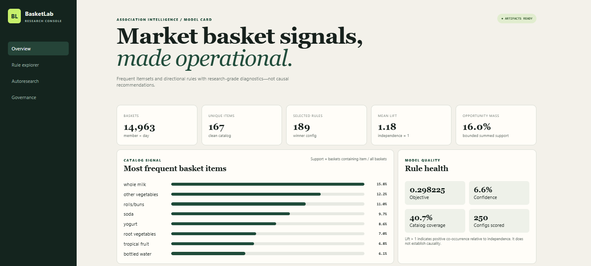
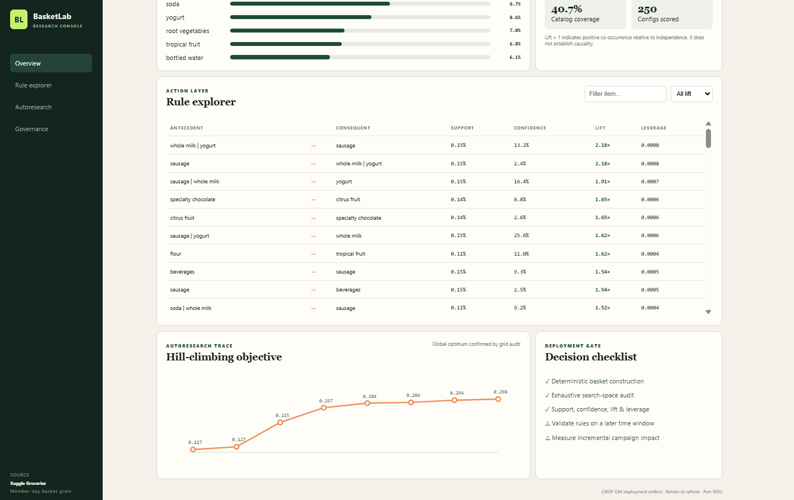

# Associative Pattern Mining

A compact, offline-friendly market-basket project using the popular **Kaggle Groceries dataset** (38,765 item rows). It follows CRISP-DM, mines interpretable association rules, runs a deterministic autoresearch hill climb, and serves a responsive Flask data-science administration dashboard.

## Quick start

```powershell
cd part-2-data-science-examples/04_associative_pattern_mining
python -m venv .venv
.venv\Scripts\Activate.ps1
pip install -r requirements.txt
python train.py
python app.py
```

Open `http://127.0.0.1:5003`. Run tests with `pytest -q`. The dataset and default artifacts are checked in, so the dashboard can run offline immediately. Pass `max_baskets` to `model.train(...)` for a smaller experiment.

## CRISP-DM implementation

1. **Business understanding:** discover interpretable product affinities for bundle ideation, navigation, and controlled cross-sell experiments. A rule is descriptive, not proof that recommending one item causes another purchase.
2. **Data understanding:** validate the three-column source schema, group the 38,765 item rows by member and purchase date, and profile basket size, catalog breadth, and item support.
3. **Data preparation:** normalize item text, drop incomplete records, and deduplicate repeated items within each member-day basket. This yields the binary presence grain required by support calculations; quantities and spend are unavailable.
4. **Modeling:** Apriori-style downward-closure pruning counts frequent itemsets of length two or three. Rules are directional and report support, confidence, lift, leverage, and conviction.
5. **Evaluation:** coordinate hill climbing tunes minimum support, confidence, lift, and maximum itemset length. Its bounded objective balances lift (30%), confidence (25%), opportunity mass (20%; summed directional-rule support divided by two and capped at one), catalog coverage (15%), and usable rule volume (10%). A 250-configuration exhaustive audit checks whether the local search reached the grid optimum.
6. **Deployment:** persist `metrics.json` and `rules.csv`; serve health and filtered dashboard APIs. Retraining is the explicit refresh path.

The dashboard mirrors that evaluation contract: source/grain disclosure, basket and catalog KPIs, item support, rule health, a searchable rule table, hill-climb trace, and deployment gates. Bars start at zero, percentages name their denominators, and lift is anchored to independence at 1.

## Key results

The full reproducible run forms **14,963 member-day baskets** from **38,006 distinct basket-item rows** across **167 items**. Hill climbing selects support **0.1%**, confidence **2%**, lift **1.0**, and maximum itemset length **3**, producing **189 positive-association rules** with mean lift **1.181**, mean confidence **6.62%**, and objective **0.298**. It evaluates all 250 grid configurations and confirms the hill-climb winner is the grid optimum.

This result is a discovery shortlist, not a production recommendation policy. Validate selected rules on a later time window, control false discoveries when testing many rules, check inventory/margin constraints, and use randomized experiments to estimate incremental value.

## Research and data provenance

- Dataset: [Groceries dataset on Kaggle](https://www.kaggle.com/datasets/heeraldedhia/groceries-dataset), 38,765 purchase-order rows. A public CSV mirror is bundled solely for reproducible educational use; review the Kaggle dataset terms before redistribution.
- Association rules: Agrawal and Srikant's [Fast Algorithms for Mining Association Rules](https://www.vldb.org/conf/1994/P487.PDF) formalizes support/confidence mining and Apriori's downward-closure search.
- Pattern growth: Han, Pei, and Yin's [FP-growth paper](https://dl.acm.org/doi/10.1145/335191.335372) motivates avoiding costly candidate generation at larger scale. This laptop-sized implementation intentionally uses transparent Apriori counting; FP-growth is the recommended scale-up path.
- Process: [CRISP-DM 1.0 guide](https://api.repository.cam.ac.uk/server/api/core/bitstreams/249ce608-2b68-4e2b-a808-5af0cfc725ff/content).

## Data scientist and AI engineer notes

- **Definitions:** support is `joint baskets / all baskets`; confidence is `joint / antecedent`; lift is `confidence / consequent support`; leverage is observed minus independence-expected joint support. Conviction is left blank when confidence is 1.
- **Reproducibility:** raw data, deterministic grouping/search, a fixed configuration grid, experiment ledger, exhaustive audit, and dependency pins make results reviewable.
- **Limits:** member-day may merge separate trips on one date; no timestamp, quantity, price, inventory, margin, exposure, or outcome exists. Frequent-item bias and multiple comparisons can create operationally weak rules.
- **Production path:** validate temporal stability, add category/inventory/margin constraints, version the source snapshot, monitor support/lift and rule coverage drift, cap latency and artifact size, and retain a fallback recommender. Never infer sensitive traits or use basket rules for consequential decisions.

## API

- `GET /api/health` — artifact readiness.
- `GET /api/dashboard?item=milk&min_lift=1.2` — metrics and filtered rules.

## Screenshots



