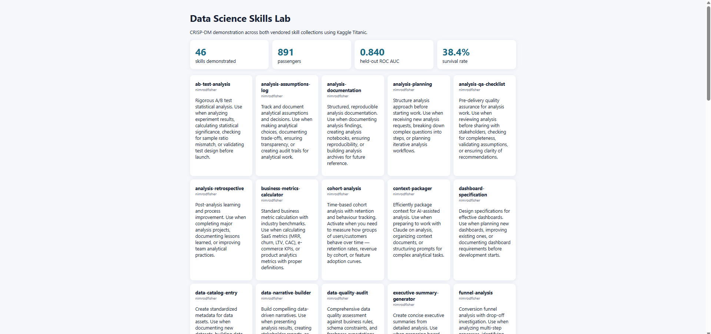

# Data Science Skills Lab

A compact, local demonstration of every skill from
[`param087/agent-ml-skills`](https://github.com/param087/agent-ml-skills) (15 skills) and
[`nimrodfisher/data-analytics-skills`](https://github.com/nimrodfisher/data-analytics-skills) (31 skills).
The skill definitions are vendored under `skills/`; `lab.py` discovers them rather than relying on a hand-maintained count and produces one evidence artifact per skill.

The executable spine uses the popular Kaggle **Titanic: Machine Learning from Disaster** dataset. This keeps the lab reproducible while covering data quality, EDA, preprocessing, leakage-safe modeling, evaluation, SQL reconciliation, retrieval, documentation, communication, and deployment. Skills that would normally require event data, a randomized experiment, a large model, or production infrastructure demonstrate the correct plan, interface, validation gate, or limitation instead of inventing evidence or downloading heavyweight assets.

## Setup and run

```powershell
cd part-2-data-science-examples/05_data_science_skills_lab
python -m venv .venv
.venv\Scripts\Activate.ps1
pip install -r requirements.txt
python lab.py
python app.py
```

Open `http://127.0.0.1:5004`. Generated evidence is written to `outputs/manifest.json` and `outputs/skills/`. Run the test suite with `pytest -q`.

Example prediction:

```powershell
$body = '{"Pclass":1,"Sex":"female","Age":30,"SibSp":0,"Parch":0,"Fare":80,"Embarked":"S"}'
Invoke-RestMethod http://127.0.0.1:5004/api/predict -Method Post -ContentType application/json -Body $body
```

## CRISP-DM

1. **Business understanding:** create a teaching lab that shows how reusable agent skills guide defensible data-science work; prediction is educational, not a consequential decision tool.
2. **Data understanding:** validate the 891-row passenger grain, schema, target balance, missingness, distributions, and segment rates. Passenger ID is unique; Age and Cabin missingness are retained as quality evidence.
3. **Data preparation:** stratify before training and fit median/mode imputation, scaling, and one-hot encoding only inside the training pipeline. This prevents preprocessing leakage.
4. **Modeling:** tune a logistic-regression pipeline over a deliberately small grid with seeded, stratified cross-validation. A TF-IDF passenger-manifest retrieval smoke test demonstrates the RAG contract without a remote model.
5. **Evaluation:** report held-out accuracy, balanced accuracy, F1, and ROC AUC; reconcile the survival rate between pandas and SQLite; verify all 46 installed skills produce artifacts. The checked-in run reaches **0.840 ROC AUC**.
6. **Deployment:** persist the fitted pipeline, expose health and validated prediction endpoints, and provide a read-only dashboard listing every demonstration. Retraining is the explicit `python lab.py` refresh path.

## Scope and provenance

- Dataset: [Kaggle Titanic competition](https://www.kaggle.com/competitions/titanic), using the 891-row training CSV mirrored by [Data Science Dojo](https://github.com/datasciencedojo/datasets/blob/master/titanic.csv). Its SHA-256 is recorded in every generated manifest.
- Installed skill sources: [param087/agent-ml-skills](https://github.com/param087/agent-ml-skills) and [nimrodfisher/data-analytics-skills](https://github.com/nimrodfisher/data-analytics-skills). The vendored `SKILL.md` files and their supporting resources remain attributable to their authors.
- The Titanic outcomes are historical and observational. Group comparisons are not causal, row order is not time, and protected-trait patterns must not be operationalized. LLM fine-tuning, PyTorch, experiment tracking services, ONNX, and production monitoring are intentionally represented by bounded workflow artifacts rather than large optional dependencies.

## Screenshots


