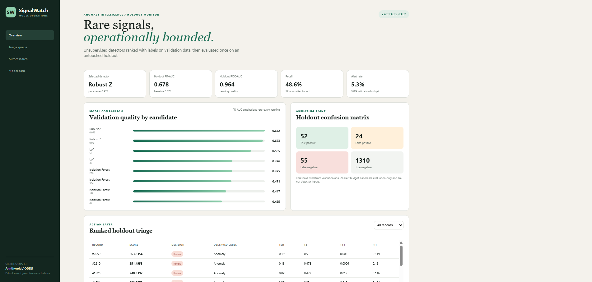
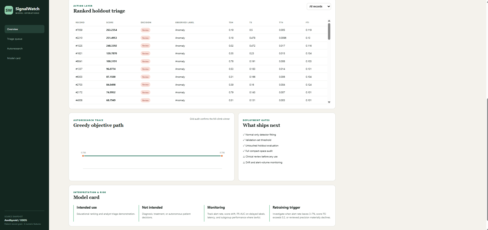

# Anomaly Detection Operations Lab

A compact, offline-ready anomaly-detection project using the popular **Kaggle/UCI Annthyroid dataset** in its six-feature ODDS benchmark form. It follows CRISP-DM, compares four established detector families, runs deterministic hill-climbing autoresearch, and serves a responsive Flask administration dashboard.

## Quick start

```powershell
cd part-2-data-science-examples/06_anomaly_detection
python -m venv .venv
.venv\Scripts\Activate.ps1
pip install -r requirements.txt
python train.py
python app.py
```

Open `http://127.0.0.1:5005`. Run `pytest -q` for the pipeline/API tests. The 88 KB dataset and default artifacts are bundled, so training and the dashboard work offline.

## CRISP-DM and modeling contract

1. **Business understanding:** rank unusual records for a capacity-limited analyst review queue. This educational system is not a diagnostic device and must not drive patient care.
2. **Data understanding:** validate 7,200 patient records, six continuous attributes, binary labels, missingness, anomaly prevalence, and class coverage in every split.
3. **Data preparation:** create a fixed, stratified 60/20/20 train/validation/holdout split. Robust or standard scaling is fit inside each detector. Only normal training records fit the unsupervised boundary.
4. **Modeling:** compare a robust multivariate z-score baseline, Isolation Forest, Local Outlier Factor in novelty mode, and RBF One-Class SVM across 14 bounded configurations.
5. **Evaluation:** use validation labels for model selection and a threshold at the validation score's 95th percentile. The objective weights PR-AUC (45%), ROC-AUC (25%), recall at the 5% review budget (20%), rank stability (10%), and a small latency penalty. A full-grid audit checks the greedy result. The holdout is evaluated once and never searched.
6. **Deployment:** persist the fitted pipeline, threshold, scored holdout, metrics, experiment ledger, and model card; expose health and dashboard APIs. Retraining is an explicit snapshot refresh.

## Key results

The bundled benchmark contains **7,200 rows**, **534 anomalies (7.42%)**, six features, and no missing values. With seed 42, hill climbing and the full 14-run audit select the **97.5th-percentile robust z-score detector**. On the untouched 1,441-row holdout it achieves **0.678 PR-AUC**, **0.964 ROC-AUC**, **68.4% precision**, and **48.6% recall**, flagging **5.27%** of records. These are reproducible benchmark results, not estimates of clinical utility.

The dashboard mirrors the evaluation contract: source and grain, holdout quality and alert-volume KPIs, validation candidate comparison, confusion matrix, filterable ranked triage, hill-climb trace, intended-use boundaries, and monitoring/retraining gates. PR-AUC is primary because anomalies are rare; ROC-AUC is retained as a complementary ranking measure.

## Research and provenance

- Dataset: [Kaggle Thyroid Disease dataset](https://www.kaggle.com/datasets/yasserhessein/thyroid-disease-data-set) and [Annthyroid anomaly benchmark description](https://shebuti.com/annthyroid-dataset/). The benchmark combines the original train/test records, keeps six numeric features, and treats the two non-normal classes as anomalies. Review upstream terms before redistribution.
- Isolation Forest: Liu, Ting, and Zhou, [Isolation Forest](https://www.lamda.nju.edu.cn/publication/icdm08b.pdf) (ICDM 2008), motivates direct isolation, subsampling, and score-based ranking.
- LOF: Breunig et al., [LOF: Identifying Density-Based Local Outliers](https://doi.org/10.1145/342009.335388) (SIGMOD 2000), motivates local-density deviation.
- One-Class SVM: Schölkopf et al., [Support Vector Method for Novelty Detection](https://research.google/pubs/support-vector-method-for-novelty-detection/) (NeurIPS 1999), motivates learning a boundary around the support of normal data.
- Process: [CRISP-DM 1.0 guide](https://api.repository.cam.ac.uk/server/api/core/bitstreams/249ce608-2b68-4e2b-a808-5af0cfc725ff/content).

## Data scientist and AI engineer notes

- **Leakage controls:** fitting uses normal training rows only; validation labels select model/threshold; the holdout is excluded from search. This is a benchmark protocol, not proof that future labels or prevalence match.
- **Operational semantics:** an alert is `score >= validation 95th percentile`. The alert budget is a capacity choice, not an estimated disease probability. Scores are model-specific and uncalibrated.
- **Reproducibility:** fixed seed/split, bounded candidates, deterministic preprocessing, complete experiment ledger, version-pinned dependencies, source snapshot, and saved model/threshold.
- **Risk:** the six anonymous numeric features lack units and demographics; no subgroup fairness or temporal drift claim is possible. The source is historical, labels simplify multiple conditions, and false negatives are material.
- **Production path:** obtain governed feature definitions and consent, use temporal/external validation, calibrate the review budget with domain owners, test subgroup performance, version schemas/data/models, secure endpoints, log decisions, and monitor alert rate, score drift, delayed-label PR-AUC, latency, and review outcomes.

## API and artifacts

- `GET /api/health` — artifact readiness.
- `GET /api/dashboard?flagged=true&limit=50` — metrics plus filtered, score-ranked holdout records.
- `artifacts/model.joblib` — detector, feature order, and threshold.
- `artifacts/metrics.json` — dataset/model/research/model-card metrics.
- `artifacts/scored_holdout.csv` — evaluation-only ranked records.

## Screenshots




