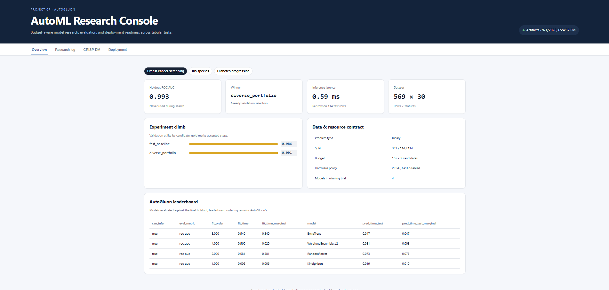

# Project 07 — AutoML with AutoGluon

A laptop-sized, CRISP-DM case study of AutoGluon Tabular on binary classification, multiclass classification, and regression. It trains real AutoGluon predictors, records a bounded hill-climbing experiment ledger, evaluates the accepted model on an untouched holdout, exposes JSON inference, and serves an administration dashboard.

## Setup and run

Python 3.10–3.12 is recommended.

```powershell
cd part-2-data-science-examples/07_automl_autogluon
python -m venv .venv
.venv\Scripts\Activate.ps1
python -m pip install -r requirements.txt
python train.py --time-limit 15 --max-candidates 2
python app.py
```

Open <http://127.0.0.1:5007>. A quick smoke run is `python train.py --time-limit 6 --max-candidates 1`. Each time limit is approximate and applies per candidate; first-run startup and model overhead can extend wall time.

## What it demonstrates

- **Business/data understanding:** three local sklearn datasets avoid downloads and keep scope reproducible.
- **Preparation:** fixed 60/20/20 train/validation/test splits; stratification for classification.
- **Modeling:** AutoGluon feature inference, a dependency-light RF/ExtraTrees/KNN portfolio, weighted ensembles, and time/CPU budgets. This intentionally avoids the much larger optional LightGBM/CatBoost/PyTorch extras.
- **Autoresearch:** an ordered greedy loop accepts a candidate only when its validation utility beats the incumbent. The holdout never selects a candidate.
- **Evaluation/deployment:** task-appropriate quality metrics, per-row latency, AutoGluon leaderboard, persisted predictors, health/dashboard APIs, and batch-capable prediction.

The dashboard reports outcomes, resource budgets, split provenance, experiment lineage, model count, latency, leaderboard, CRISP-DM status, and production guardrails. The sample datasets are teaching fixtures—not evidence that a model is ready for clinical or business decisions.

## Results

Run-specific results live in `artifacts/metrics.json`; model bundles live under `artifacts/models/`. Expected small-run behavior is ROC AUC above 0.90 for breast cancer, high iris accuracy, and a positive diabetes R², though exact winners and scores vary with AutoGluon/library versions and time budgets.

## Test

```powershell
pytest -q
pytest -q -m integration
```

The integration test performs real training for all three tasks, reloads artifacts, calls inference, and exercises the dashboard. The ordinary tests validate data and missing-artifact behavior.

## Research basis and scope

AutoGluon-Tabular's central result is that heterogeneous models plus multi-layer stacking can use a time budget more effectively than narrow hyperparameter search. This project keeps its portfolio/ensemble principle, but the “autoresearch” controller is deliberately modest: it borrows the measurable propose → run → keep/discard loop from Karpathy's autoresearch and applies it to fixed AutoGluon configurations. It is not an LLM agent and makes no benchmark/SOTA claim.

- Erickson et al., [AutoGluon-Tabular: Robust and Accurate AutoML for Structured Data](https://arxiv.org/abs/2003.06505) (2020).
- AutoGluon, [`TabularPredictor.fit` documentation](https://auto.gluon.ai/stable/api/autogluon.tabular.TabularPredictor.fit.html).
- Karpathy, [autoresearch](https://github.com/karpathy/autoresearch) (experiment-loop inspiration).

For a production extension: use repeated or nested validation, uncertainty estimates, calibration/fairness tests, drift monitors, schema contracts, authenticated serving, a model registry, and datasets representative of the real operating population.

## Screenshots


