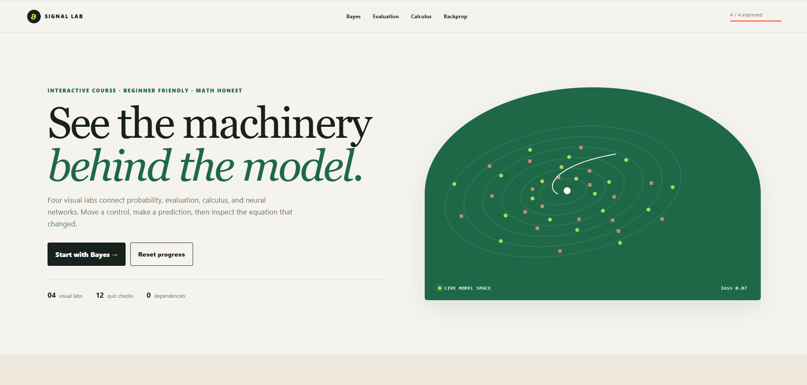
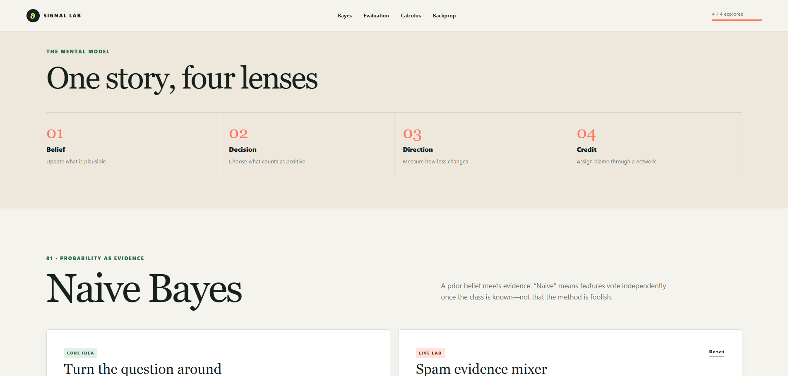
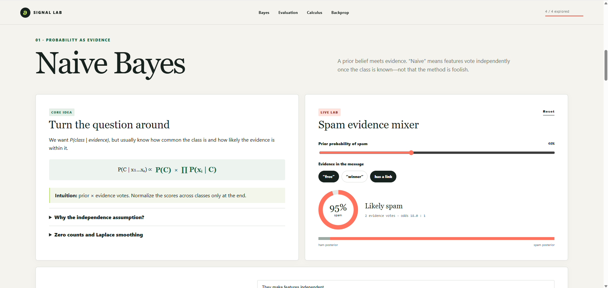
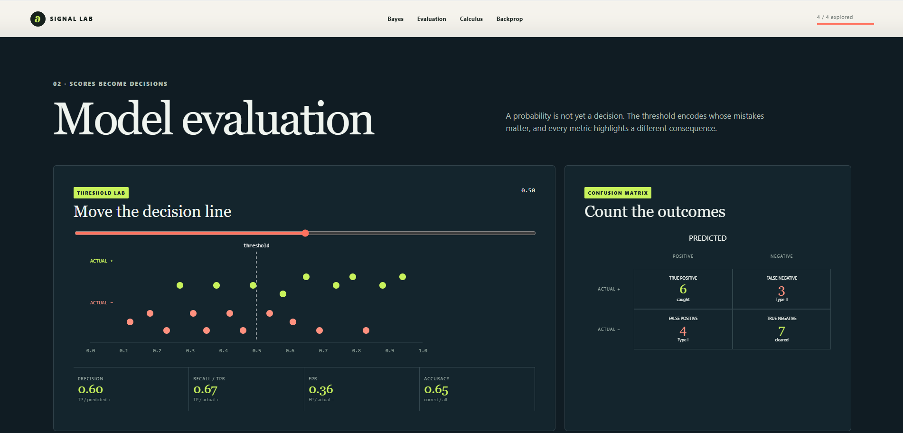
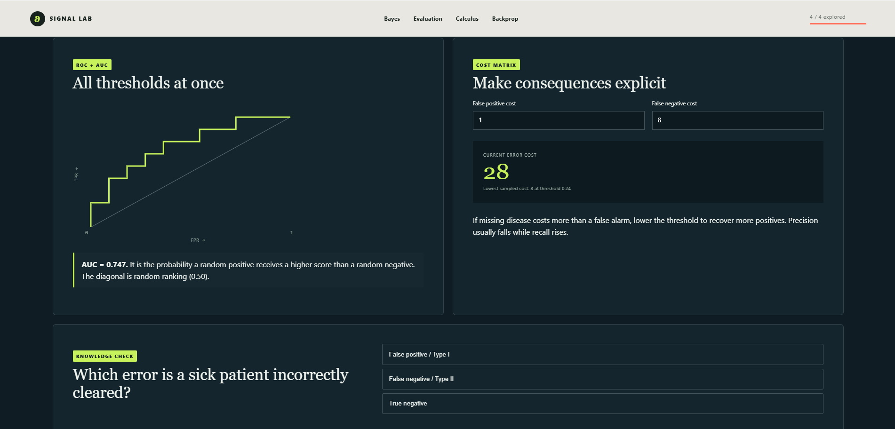
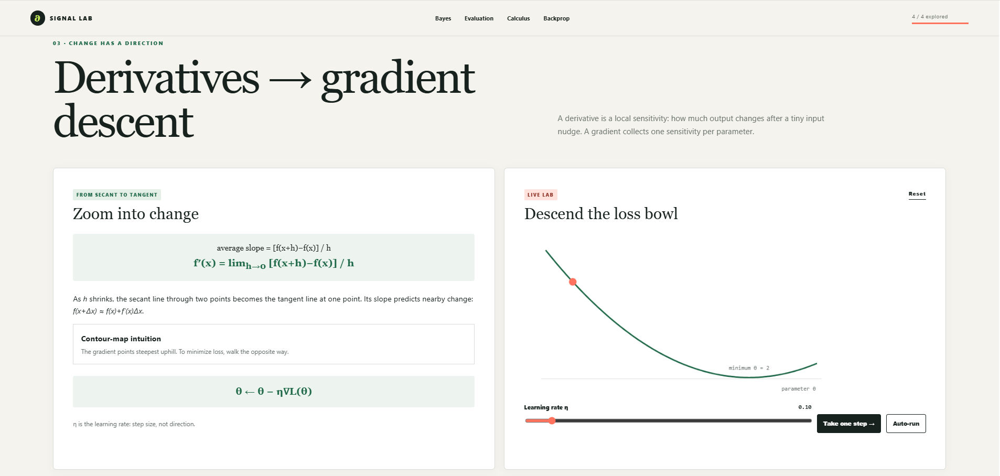
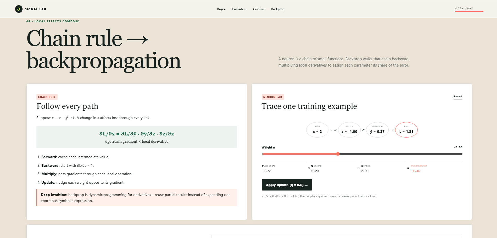

# Project 08: Data Science Visual Mastery

Signal Lab is a dependency-free, interactive course for beginner data science students. It develops visual intuition and mathematical understanding for:

- Naive Bayes, priors, likelihoods, independence, and smoothing
- Confusion matrices, Type I/II errors, precision/recall, ROC-AUC, thresholds, and error costs
- Derivatives, local sensitivity, gradients, and gradient descent
- The chain rule and backpropagation through a one-neuron computation graph

Each module includes a live simulation and quiz. The final section contains interview questions with expandable model answers. Progress is stored only in the browser's `localStorage`.

## Run locally

No packages or build step are required. From this directory, run:

```bash
python -m http.server 8000
```

Open <http://localhost:8000>. Opening `index.html` directly also works in modern browsers.

## Publish with GitHub Pages

The site uses relative asset paths and is ready for static hosting. In the repository's GitHub **Settings → Pages**, publish from the branch/folder containing this directory, or copy this directory's three site files to the configured Pages root.

## Quick validation

```bash
node --check app.js
python -m http.server 8000
```

Then exercise each slider/button, answer the four quizzes, and resize the browser to check the mobile layout.

## Screenshots








