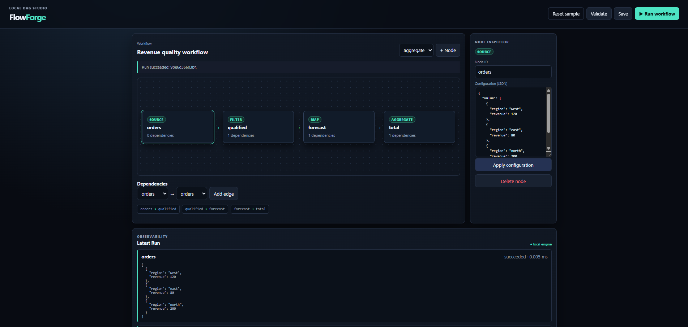

# FlowForge DAG Engine

FlowForge is a dependency-free browser studio backed by a small Flask/SQLite application. It demonstrates an end-to-end workflow system: graph authoring, validation, deterministic topological planning, local execution, failure propagation, persistence, and Run inspection.

The example applies Matt Pocock's engineering skills through a domain glossary, an explicit [feature specification](docs/spec.md), a deep DAG module, behavior-first tests at public seams, and a final two-axis review. It intentionally avoids production infrastructure such as queues, distributed workers, authentication, and cloud services.

## Run locally

```bash
cd part-2-data-science-examples/09_flowforge_dag_engine
python -m venv .venv
# Windows: .venv\Scripts\activate
# macOS/Linux: source .venv/bin/activate
pip install -r requirements.txt
python app.py
```

Open <http://127.0.0.1:5000>. The seeded revenue Workflow can be edited and run immediately. Saved Workflows and Runs are stored in the local `flowforge.db` file.

Node configuration is JSON. Available Node types are:

- `source`: emits a configured list of objects.
- `filter`: keeps objects using `eq`, `gte`, or `lte` on a field.
- `map`: multiplies a numeric field by a factor.
- `aggregate`: computes `sum` or `avg` for a field.
- `fail`: creates a controlled failure to demonstrate downstream skipping.

## Test

```bash
python -m pytest
node --test tests/graph-utils.test.js
```

The Python suite covers DAG planning, cycle rejection, data transforms, failure propagation, SQLite persistence, the HTTP lifecycle, and page/health availability. The JavaScript suite covers browser graph edits through the same public functions used by the UI.

## Screenshots



