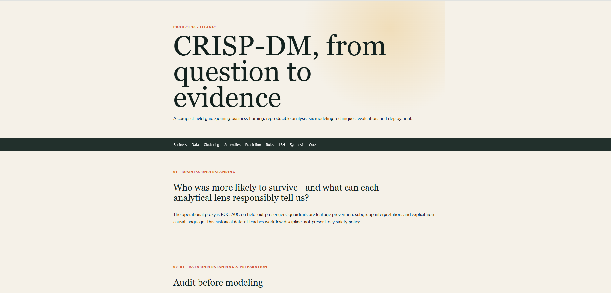
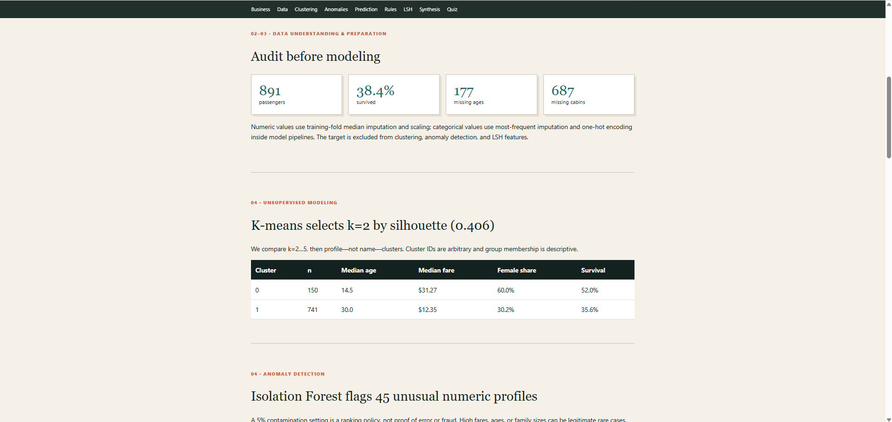
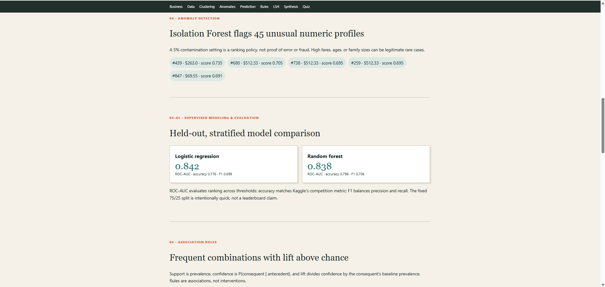
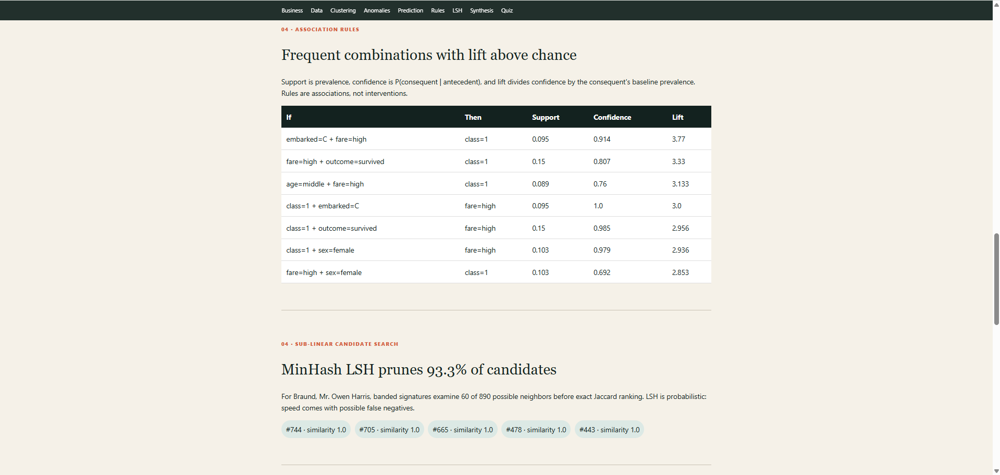
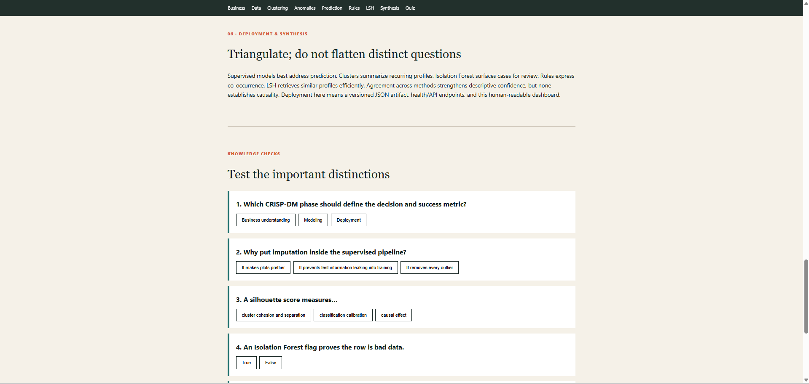

# Project 10: CRISP-DM Master's Curriculum

An end-to-end teaching project built around Kaggle's 891-row **Titanic: Machine Learning from Disaster** training set. One deterministic pipeline demonstrates EDA and preprocessing, K-means clustering, Isolation Forest anomalies, supervised classification, association rules, and MinHash locality-sensitive hashing (LSH). A responsive Flask dashboard explains the executed results and includes seven knowledge checks.

The data is bundled for offline use under Kaggle's educational-use terms. See [CURRICULUM.md](CURRICULUM.md) for the textbook walkthrough, formulas, interpretation, and CRISP-DM phase gates.

## Setup and run

From this directory:

```bash
python -m venv .venv
# Windows: .venv\Scripts\activate
# macOS/Linux: source .venv/bin/activate
pip install -r requirements.txt
python -m crispdm.pipeline
python app.py
```

Open <http://127.0.0.1:5000>. The pipeline writes `artifacts/results.json`; the app rebuilds it automatically if missing. Run the reproducible notebook with:

```bash
jupyter nbconvert --execute --to notebook --inplace notebooks/crispdm_walkthrough.ipynb
```

## Key results (fixed seed 42)

- 891 passengers; 38.4% survived; Age has 177 missing values and Cabin has 687.
- K-means selected 2 clusters from k=2–5 (silhouette 0.406).
- Isolation Forest flagged 45 profiles under the explicit 5% contamination policy.
- Logistic regression reached 0.842 held-out ROC-AUC; random forest reached 0.838. Their accuracies were 0.776 and 0.798 respectively.
- The strongest displayed rules connect first class and high fares; these are associations, not causal effects.
- MinHash LSH examined 60 of 890 possible neighbors for the demonstration query—a 93.3% candidate reduction—before exact Jaccard ranking.

These are teaching results from one stratified holdout, not a competition leaderboard or safety-policy analysis.

## Test

```bash
python -m pytest -q
```

Tests execute the full pipeline, validate metric/rule/search invariants, and exercise the dashboard, JSON API, and health endpoint.

## Project map

- `crispdm/pipeline.py` — all reproducible analytical stages
- `notebooks/crispdm_walkthrough.ipynb` — top-to-bottom runnable companion
- `CURRICULUM.md` — detailed concepts, formulas, phase gates, and synthesis
- `app.py`, `templates/`, `static/` — dashboard and quizzes
- `data/titanic.csv` — local Kaggle-compatible training data
- `artifacts/results.json` — generated evidence contract used by the app
- `tests/` — workflow and application tests

Dataset source: [Kaggle Titanic competition](https://www.kaggle.com/competitions/titanic/overview). The bundled CSV is the commonly mirrored Kaggle training file; retain Kaggle's terms when redistributing it.

## Screenshots







