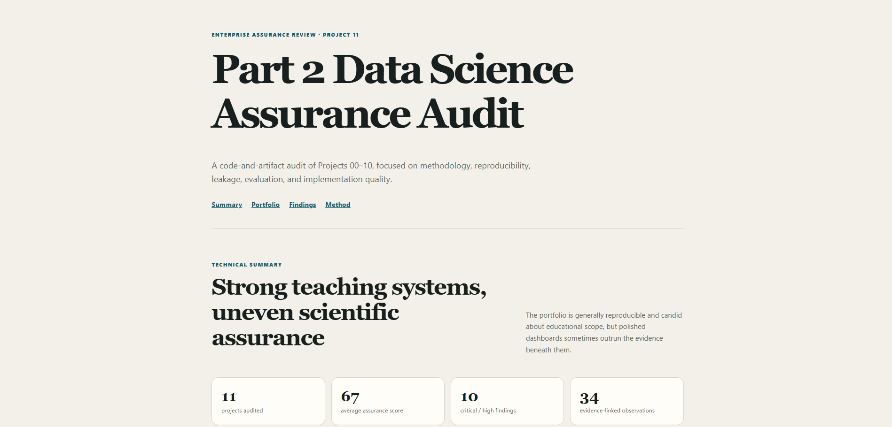
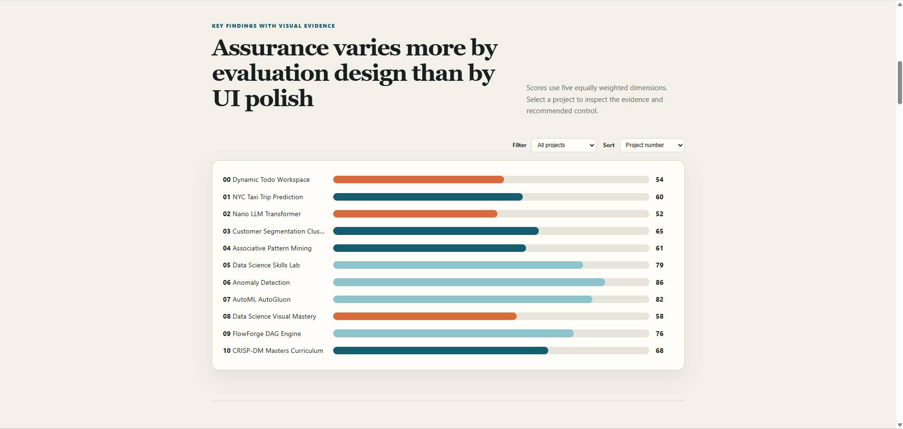
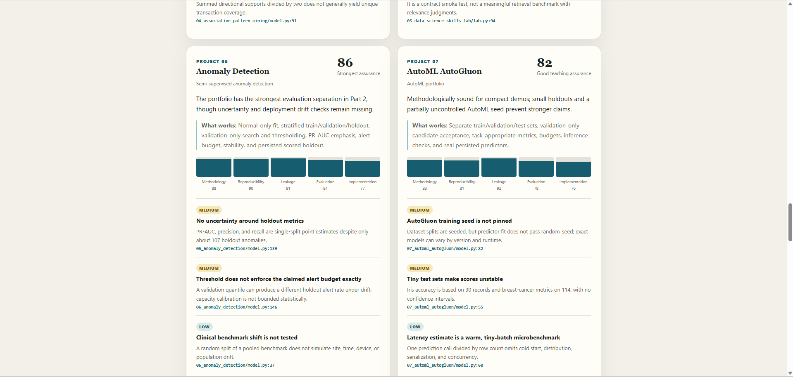

# Enterprise Data Science Audit

A dependency-free audit website covering Part 2 Projects 00–10. It reports evidence-linked findings across methodology, reproducibility, leakage control, evaluation, and implementation quality. The audit is read-only with respect to the reviewed projects.

## Run

From this directory:

```bash
python -m http.server 8011
```

Open <http://localhost:8011>. No package installation or build step is required.

## Test

```bash
node --test tests/audit.test.js
node --check app.js
```

The tests validate complete project coverage, score/rubric bounds, finding severity, and evidence-path contracts. The website supports light/dark system themes, keyboard navigation, responsive layouts, project filtering, and score sorting.

## Screenshots




