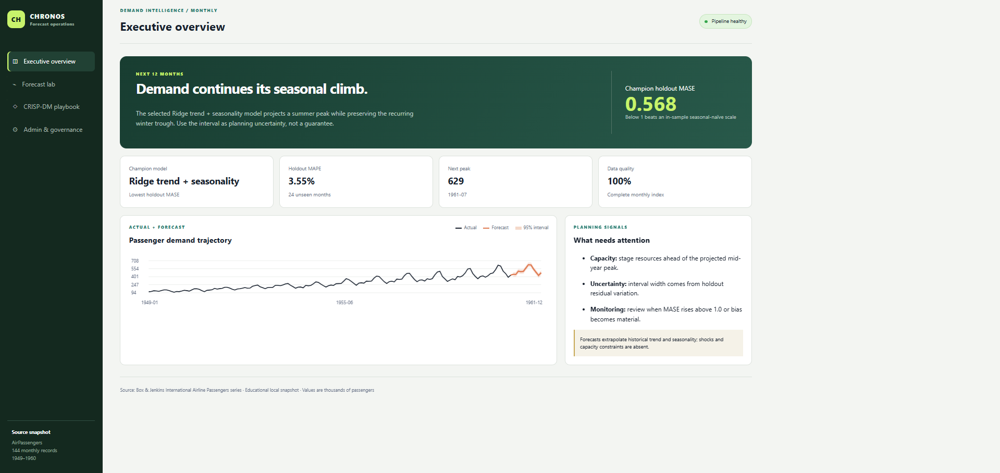
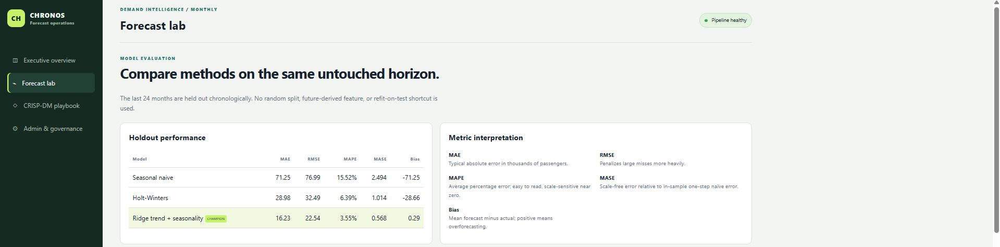
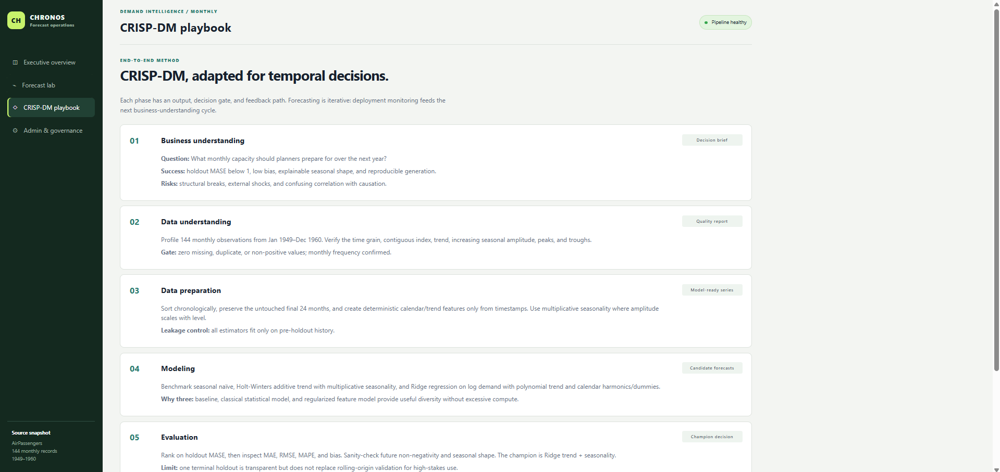
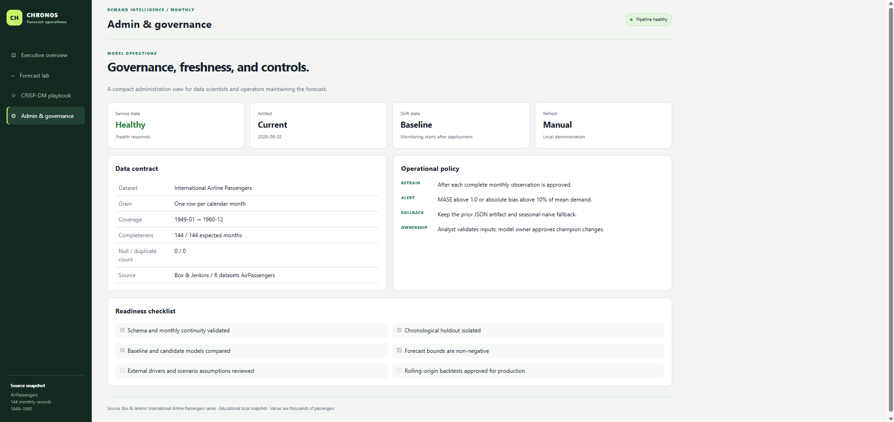

# Project 12: Chronos Time-Series Forecasting

A locally runnable forecasting project using the classic 144-month **International Airline Passengers** (`AirPassengers`) series. A reproducible pipeline compares three common methods on an untouched 24-month holdout, selects a champion by MASE, produces a 12-month forecast, and writes the evidence used by a responsive Flask website.

The website includes executive, forecast-lab, detailed CRISP-DM, and administration/governance dashboards. Charts use a small local canvas renderer, so the application has no browser CDN dependency.

## Setup and run

From this directory:

```bash
python -m venv .venv
# Windows: .venv\Scripts\activate
# macOS/Linux: source .venv/bin/activate
pip install -r requirements.txt
python -m forecasting.pipeline
python app.py
```

Open <http://127.0.0.1:5012>. The application rebuilds `artifacts/forecast.json` automatically if it is missing.

## Key results

Using the fixed last 24 months (1959–1960) as the holdout:

- Ridge trend + seasonality is the champion: MASE 0.568, MAE 16.23 thousand, RMSE 22.54 thousand, MAPE 3.55%, and essentially neutral bias (+0.29 thousand).
- The 1961 point forecast peaks at about 629.2 thousand passengers in July.
- Holt-Winters and seasonal naïve remain visible, interpretable challengers.
- The source passes the local contract: 144 unique, contiguous, positive monthly observations with no missing values.

MASE is scaled by in-sample seasonal-naïve errors at lag 12. The displayed 95% interval is an approximate residual interval, not a calibrated guarantee. This compact educational backtest omits exogenous drivers and structural-break scenarios.

## Test

```bash
python -m pytest -q
```

Tests run the forecasting pipeline, validate its time-series/data contracts and champion rule, check forecast invariants, render every dashboard view through Flask, and exercise `/api/forecast` and `/health`.

## Project map

- `forecasting/pipeline.py` — validation, temporal split, models, metrics, forecast, and artifact generation
- `data/air_passengers.csv` — bundled public sample series for offline reproducibility
- `artifacts/forecast.json` — generated evidence contract shared by every dashboard
- `app.py`, `templates/`, `static/` — Flask endpoints and responsive dashboards
- `tests/` — pipeline and application tests

Dataset provenance: the International Airline Passengers series popularized by Box and Jenkins and distributed as R's `AirPassengers` dataset. Values are monthly international airline passenger totals in thousands from 1949 through 1960.

## Screenshots




